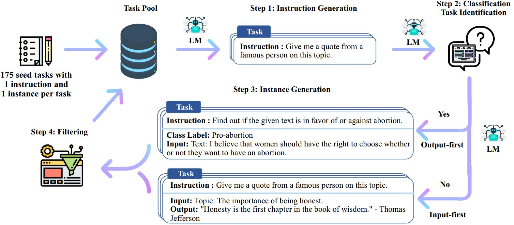

# Self-Instruct: Aligning LM with Self Generated Instructions
This repository contains code and data for the [Self-Instruct paper](https://arxiv.org/abs/2212.10560), a method for aligning pretrained language models with instructions.

## Introduction
Self-Instruct is a framework that helps language models improve their ability to follow natural language instructions. It does this by using the model's own generations to create a large collection of instructional data. With Self-Instruct, it is possible to improve the instruction-following capabilities of language models without relying on extensive manual annotation.

### Background
In recent years, there has been a growing interest in building models that can follow natural language instructions to perform a wide range of tasks. These models, known as "instruction-tuned" language models, have demonstrated the ability to generalize to new tasks. However, their performance is heavily dependent on the quality and quantity of the human-written instruction data used to train them, which can be limited in diversity and creativity. To overcome these limitations, it is important to develop alternative approaches for supervising instruction-tuned models and improving their instruction-following capabilities.

### How Self-Instruct works?
The Self-Instruct process is an iterative bootstrapping algorithm that starts with a seed set of manually-written instructions and uses them to prompt the language model to generate new instructions and corresponding input-output instances. These generations are then filtered to remove low-quality or similar ones, and the resulting data is added back to the task pool. This process can be repeated multiple times, resulting in a large collection of instructional data that can be used to fine-tune the language model to follow instructions more effectively.

Here is an overview of Self-Instruct:




## Setup
Code and data for the Self-Instruct framework will be made available in this repository soon.

## Citation
If you use the Self-Instruct framework or data, feel free to cite us. 
```bibtex
@misc{selfinstruct,
  title={Self-Instruct: Aligning Language Model with Self Generated Instructions},
  author={Wang, Yizhong and Kordi, Yeganeh and Mishra, Swaroop and Liu, Alisa and Smith, Noah A. and Khashabi, Daniel and Hajishirzi, Hannaneh},
  journal={arXiv preprint arXiv:2212.10560},
  year={2022}
}
```
